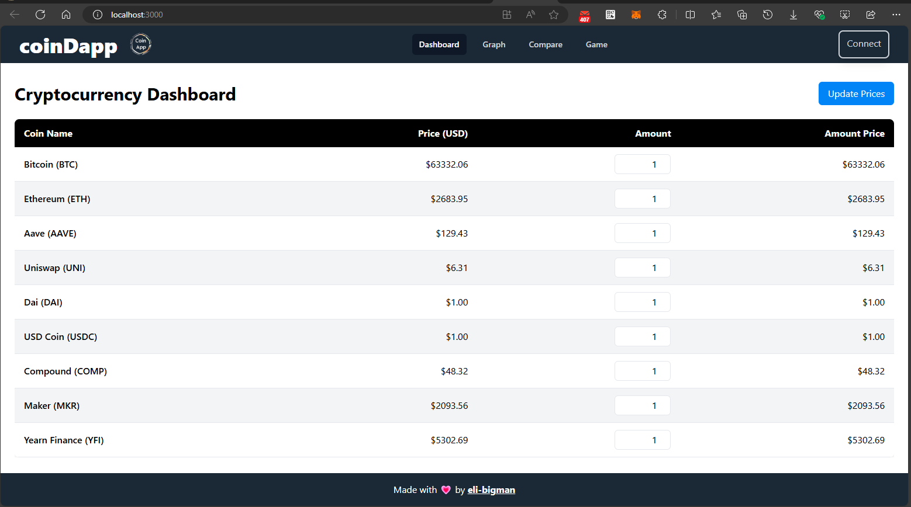
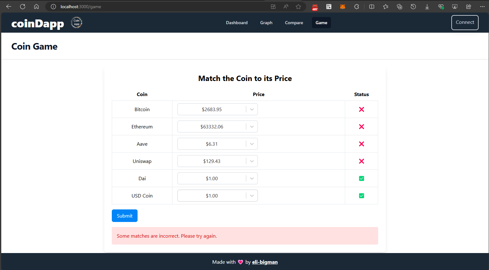
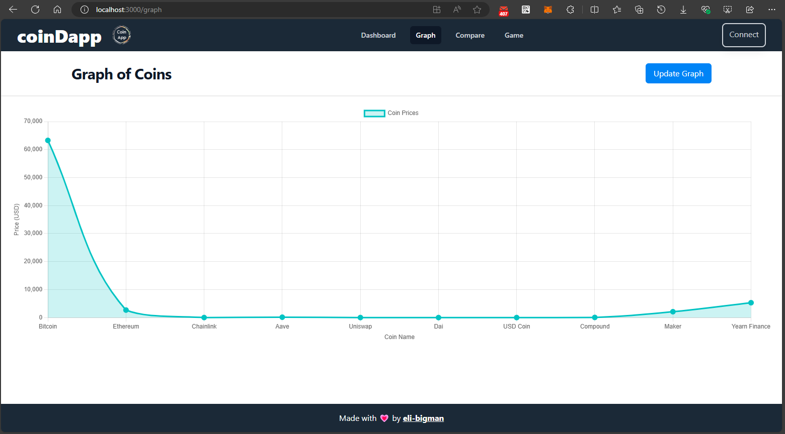
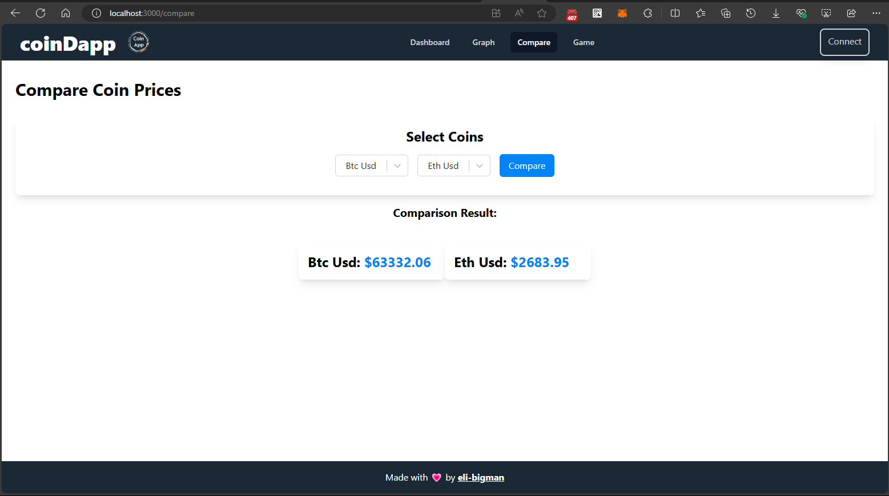

# CoinDapp 🚀

CoinDapp is a cryptocurrency dashboard application built with [Web3.js](https://github.com/ChainSafe/web3.js). 

## Live Demo 🌐

Check out the live version of CoinDapp here: [CoinDapp on Fleek](https://coindapp.on-fleek.app/)

## Features

### Dashboard 📊

View real-time cryptocurrency prices, update them, and manage your portfolio.

### Game 🎮

An interactive game where you can match cryptocurrencies to their prices.

### Graph 📈

Visualize price trends of cryptocurrencies over time.

### Compare 🔍

Compare the prices of two cryptocurrencies side by side.

## Built With ❤️

- [Web3.js](https://github.com/ChainSafe/web3.js)

## Getting Started

This project was bootstrapped with [Create React App](https://github.com/facebook/create-react-app).

### Available Scripts

In the project directory, you can run:

#### `npm start`

Runs the app in development mode.\
Open [http://localhost:3000](http://localhost:3000) to view it in your browser.

#### `npm test`

Launches the test runner in interactive watch mode.\
See the section about [running tests](https://facebook.github.io/create-react-app/docs/running-tests) for more information.
